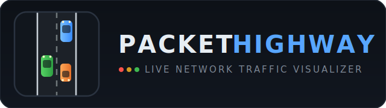

<p align="center">
  
</p>

<p align="center">
  <b>A real-time 3D network traffic visualization platform.</b><br>
  Every packet crossing your interface becomes a vehicle on a living, cinematic highway.
</p>

---

## What it is

PacketHighway turns raw network telemetry into an immersive 3D scene rendered
in the browser. A Python capture engine streams live packet summaries over
WebSocket into a React Three Fiber front-end, where traffic flows across an
eight-lane highway through a night-time smart city — complete with a NOC-style
glassmorphism dashboard, security alerting and a DDoS attack simulation mode.

| Protocol | Fleet                      |
| -------- | -------------------------- |
| HTTPS    | 🟢 electric SUVs           |
| HTTP     | 🟠 delivery vans           |
| DNS      | 🟣 motorcycles             |
| TCP      | 🔵 executive sedans        |
| UDP      | 🟡 sports cars             |
| ICMP     | 🔴 emergency vehicles (with working lightbar) |
| OTHER    | ⚪ utility pickups         |

**Visual language:** encrypted traffic glows green · suspicious traffic gets a
pulsing red ring · packet size and latency shape speed · braking, lane changes
and turn signals are fully simulated — no teleporting, no instant speed changes.

## Architecture

```
 ┌──────────────┐  packet    ┌───────────────────┐  60ms batch   ┌──────────────────────┐
 │ scapy sniff  │ ─summary─▶ │ asyncio batcher   │ ──WebSocket─▶ │ React Three Fiber    │
 │ or demo /    │            │ + flood sampler   │               │ instanced 3D renderer│
 │ attack gen   │ ◀──cmd──── │ (websockets lib)  │ ◀──commands── │ + zustand HUD state  │
 └──────────────┘            └───────────────────┘               └──────────────────────┘
```

- **Capture engine** ([packet_highway.py](packet_highway.py)) — scapy reduces each
  packet to protocol, endpoints, ports, size, direction, latency and security
  flags. Above 100 packets per 60 ms batch the browser receives a random
  sample, but totals stay exact, so the dashboards never lie under load.
- **Traffic simulation** ([src/sim/traffic.js](src/sim/traffic.js)) — object-pooled
  vehicles with car-following physics, smooth acceleration/braking and natural
  lane-change logic with turn signals.
- **Renderer** ([src/three](src/three)) — the entire fleet is drawn with ~11
  `InstancedMesh` draw calls regardless of vehicle count. PBR materials,
  bloom + vignette post-processing, volumetric-style light pools, procedural
  cyber city with animated data centers, comm towers and live digital
  billboards.

## Features

- 🎥 **Cinematic camera system** — fly-in intro, free orbit, auto-cinematic
  drift, and per-packet follow cam
- 🔍 **Packet inspection** — hover for live telemetry, click for a full
  inspector panel (IPs, ports, size, latency, timestamp, flags)
- 📊 **NOC dashboard** — live throughput graph, protocol distribution,
  top talkers, network health score, security alert feed
- ⚠️ **Threat view** — one click dims benign traffic and spotlights anomalies
- ☠️ **Attack simulation** — trigger a DDoS flood and watch the highway,
  alerts and health score react in real time
- 🔎 **IP search** — highlight matching vehicles, dim everything else
- ⏯️ Pause, 0.25×–3× time scale, protocol filtering

## Quick start

```bash
pip install -r requirements.txt

# Demo mode — synthetic traffic, no privileges needed
python packet_highway.py --demo

# Live mode — real packets
python packet_highway.py
python packet_highway.py --iface "Wi-Fi"
```

Open **http://127.0.0.1:8350**. A pre-built frontend ships in `dist/`,
so Node.js is only needed if you want to modify the UI:

```bash
npm install
npm run build        # or: npm run dev (Vite dev server)
```

### Live capture requirements

| OS      | Requirement                                                 |
| ------- | ----------------------------------------------------------- |
| Windows | [Npcap](https://npcap.com) installed + run as Administrator |
| Linux   | `sudo`, or `setcap cap_net_raw+ep` on the Python binary     |
| macOS   | `sudo`                                                       |

### Options

```
--demo            synthetic traffic instead of live capture
--iface IFACE     interface to sniff (default: scapy's choice)
--port PORT       dashboard HTTP port   (default 8350)
--ws-port PORT    WebSocket port        (default 8765)
```

If you change `--ws-port`, open `http://127.0.0.1:8350/?ws=<port>`.

## Performance

Designed for a steady 60 FPS with hundreds of concurrent vehicles:
instanced rendering (one draw call per vehicle part, not per vehicle),
object pooling with zero per-frame allocations in the hot path, canvas-based
charts, and a sampling pipeline that keeps statistics exact while capping
render load.

## Tech stack

`Python` `scapy` `asyncio` `websockets` · `React 18` `Three.js`
`@react-three/fiber` `drei` `postprocessing` `zustand` `Vite`

## License

MIT
